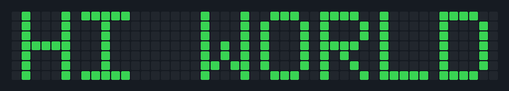

# ✍️ github-graph-writer

> Write words and messages on your GitHub contribution graph using backdated commits.


---

## How it works

GitHub's contribution graph is a 7-row × 52-column grid where each cell represents a day.
Darker cells = more commits on that day.

This tool calculates which specific **past dates** correspond to each pixel of your message (using a 5×7 pixel font), then creates commits on those dates using `git commit --date`.



## Quick start (GitHub Actions — no local setup needed)

1. **Fork this repository** (or use it as a template)
2. Go to **Actions** tab → **✍️ Write on Contribution Graph** → **Run workflow**
3. Fill in the form:
   - **text** — what to write, e.g. `HELLO` or `HI MOM`
   - **year** — which year's graph to draw on (must be in your last ~52 weeks)
   - **week_offset** — blank weeks before the message starts (default `2`)
   - **intensity** — darkness of the pixels (`1`–`4`, default `4`)
4. Click **Run workflow** and watch the magic happen ✨


## ⚠️ Important setup step

After creating your repo from the template, update the git identity in **both** workflow files so commits count toward your graph:

`.github/workflows/write.yml` and `.github/workflows/clear.yml`

```yaml
git config user.name  "YOUR_GITHUB_USERNAME"
git config user.email "YOUR_GITHUB_EMAIL"
```
> Make sure the repository is set as your contribution source.
> GitHub only counts commits to **public repos** or **private repos you own** on your default branch.
---

## Local usage

```bash
# Clone your fork
git clone https://github.com/YOUR_USERNAME/github-graph-writer
cd github-graph-writer

# Preview (no commits made)
python scripts/generate_commits.py --text "HELLO" --year 2024 --dry-run

# Write it for real
python scripts/generate_commits.py --text "HELLO" --year 2024 --intensity 4

# Push
git push origin main
```

### Options

| Flag | Description | Default |
|------|-------------|---------|
| `--text` | Message to write (A–Z, 0–3, space, `!`, `.`) | required |
| `--year` | Year to draw on | last year |
| `--week-offset` | Blank weeks before text starts | `2` |
| `--intensity` | Commits per pixel (`1`–`4`) | `4` |
| `--dry-run` | Preview without making commits | `false` |

---

## Supported characters

```
A B C D E F G H I J K L M N O P Q R S T U V W X Y Z
0 1 2 3   (space)  !  .
```

---

## Tips

- **Longer messages** need more weeks — check the dry-run preview. A full year has ~52 weeks.
- **Year choice**: you can only draw in the year that still appears on your graph (GitHub shows ~52 weeks). Use last year for a full canvas.
- **Clean slate**: if you want to redo a year, delete the `output/` files and force-push — but note this rewrites history.
- **Intensity levels**: level `4` shows the darkest green. Use `1`–`2` for a lighter look, or mix runs to create gradient effects.

---
## Clearing your contribution art

To remove existing art from the graph, go to **Actions** tab → **🗑️ Clear Contribution Art** → **Run workflow** and fill in:

- **year** — the year you want to clear (e.g. `2024`), or type `ALL` to wipe everything
- **confirm** — type `YES` to confirm

This will delete all generated commits for that year so you can draw something new.


In the likely event that the workflow does not wor... **You can also delete the whole repository**


## Contributing

Contributions are welcome! Some ideas:
- [ ] Add more characters / punctuation to the font
- [ ] Support lowercase letters
- [ ] Add a web-based preview tool
- [ ] Support custom pixel art (not just text)

Open an issue or PR anytime.

---

## License

MIT — do whatever you want with it. A star ⭐ is always appreciated!
